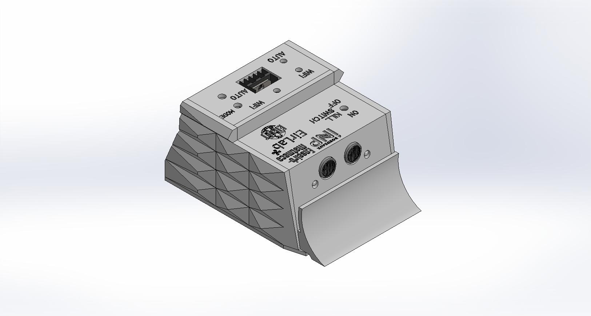
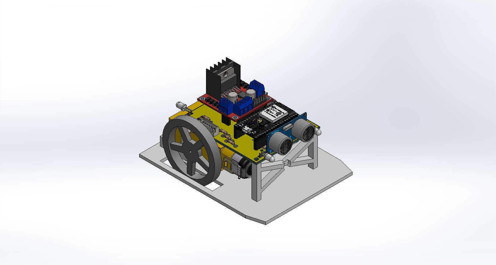

# Stage - Robot Différentiel pilotable

Projet réalisé dans le cadre du **Stage de Première année**

**Ateliers destinés aux stagiaires de seconde**  
**ENSEIRB-MATMECA – CEA** 

**Auteurs :**  
Mattéo BINET  
Bastien TRAN-RUESCHE 

**Encadrant :**  
Thierry TARIS

**Date :** Juin 2025  

---

## Présentation générale

Cet atelier a été conçu dans le cadre du partenariat entre **l’ENSEIRB-MATMECA** et le **CEA**, dans le but d’initier des élèves de seconde aux bases de la robotique.  
Il s’est déroulé à **EirLab**, le fablab de l’enseirb, sur des séances de trois heures encadrées par des étudiants de première année.

L’objectif était de faire découvrir la démarche complète de conception d’un système embarqué à travers la réalisation d’un **robot différentiel pilotable**.  
L’atelier combine ainsi trois volets :  
1. la **découverte du robot et de ses composants** ;  
2. la **fabrication partielle du châssis** et l’assemblage ;  
3. la **programmation du comportement autonome** du robot.

---

## Le robot

  
  

Le robot conçu est un **modèle différentiel** à deux roues motrices et une roue folle.  
Chaque moteur est commandé indépendamment à l’aide d’un **driver L298**, piloté par un **microcontrôleur ESP32** programmé dans l’environnement Arduino.  
L’ensemble est relié par une **carte d’interconnexion** assurant la distribution de l’alimentation et des signaux de commande.

Les principaux éléments du système sont :
- ESP32 (microcontrôleur)  
- Driver moteur L298  
- Deux moteurs à courant continu  
- Capteur à ultrasons  
- LEDs et interrupteurs  
- Batterie d’alimentation  

Le robot peut se déplacer, s’arrêter en fonction de la détection d’obstacles et être commandé à distance via une interface sans fil.

---

## Déroulement de l’atelier

L’atelier débute par une présentation du principe du robot différentiel et de ses composants électroniques.  
Les élèves réalisent ensuite la **plaque inférieure du châssis** à l’aide d’une **découpeuse laser**, puis procèdent à l’assemblage mécanique et à la soudure des moteurs.

La seconde partie est consacrée à la **programmation**.  
À partir d’un code partiellement fourni, les élèves complètent la logique du comportement autonome du robot à l’aide de fonctions simples issues d’une bibliothèque dédiée (`pami_lib.h`).

Exemples de fonctions utilisées :
- `avancer()`, `reculer()`, `stop()` : contrôle du déplacement  
- `mesurerDistance()` : lecture du capteur à ultrasons  
- `bluetoothControl()` : pilotage sans fil  

L’objectif final est d’obtenir un robot capable d’avancer, de s’arrêter en présence d’un obstacle et, en bonus, d’effectuer une manœuvre d’évitement.

---

## Objectifs pédagogiques

- Introduire les bases de la **robotique mobile** et des systèmes embarqués.  
- Apprendre à **assembler** et **câbler** un système électronique simple.  
- Découvrir la **programmation en C/Arduino** appliquée au pilotage de moteurs.  
- Développer des compétences de **rigueur, logique et travail collaboratif**.  

---

## Conclusion

Cet atelier illustre de manière concrète le processus complet de conception d’un système robotique :  
de la modélisation mécanique à la programmation, en passant par l’assemblage électronique.  
Il permet aux élèves de seconde d’aborder de façon pratique les disciplines de l’ingénierie et de découvrir le fonctionnement d’un robot autonome.

---

## Contenu du dépôt GitHub

Le dépôt [Stage - Robot Différentiel pilotable](https://github.com/matteob29/Stage_-_Robot_Differentiel_pilotable) contient les éléments suivants :

- [Codes/](./Codes)                        → Programmes ESP32 avec les controlles Wifi ou manette de PS4
- [Datasheets/](./Datasheets)                → Datasheet des coomposants utilisés
- [Images/](./Images)                      → Illustrations, photos et rendus du robot
- [Meca/](./Meca)                          → Modèles 3D et plans mécaniques (SolidWorks, SVG)
- [PCB/](./PCB)                            → Layouts et typons
- [Rapports/](./Rapports)                    → Rapports de stage et documents de présentation
- [README.md](./README.md)
  
---

© 2025 — Mattéo BINET, Bastien TRAN-RUESCHE  
Département Électronique — Stage 1ère année  
Enseirb-Matmeca — Robot Différentiel pilotable
